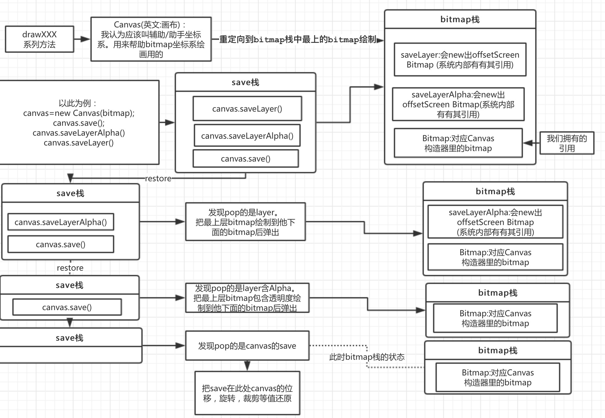

#Canvas

##图片理解模型


##我的启蒙关键就是saveLayer的官方文档：
```
This behaves the same as save(), but in addition it allocates and redirects drawing to an offscreen bitmap.
All drawing calls are directed to a newly allocated offscreen bitmap. 
Only when the balancing call to restore() is made, 
is that offscreen buffer drawn back to the current target of the Canvas (either the screen, it's target Bitmap, or the previous layer).
```
>大概意思:新建的一个bitmap(离屏)代表Layer(叫他是因为层的概念我们好理解),后续全部的操作(包括drawingXXX)都会定向到这个新的离屏bitmap,仅仅当restore的时候,离屏的绘制缓存才能绘制到current target of the Canvas(bt/offscreen)上

##疑问 

###Canvas我为什么认为叫 辅助/助手坐标系？
先看一个例子：
```
new Cavas(bitmap);
cavas.translate(0,10);
cavas.drawLine(...)//横线
cavas.translate(0,10);
cavas.drawLine(...)//横线
```
结果是：bitmap没有随着cavas.translate位移而改变，但是canvas.translate后边的draw后边的发生改变了
说明draw方法是已canvas的参考系为参考,而canvas的参考系有rorate，translate，clip 等属性；
经过这些属性的调整最终映射到bitmap坐标系进行绘制,绘制在bitmap的图像就和canvas没关系了(既调整canvas也不会改变bitmap的图像)

**结论：canvas就像 辅助坐标系，辅助draw方法绘制到最终的bitmap上**
鼠绘的人会不停的旋转画布翻转画布，来绘制线条，主要为了为更舒适(对我们来说就是更简单,更容易理解 )；

###canvas怎么就让绘制简单了？
```
new Cavas(bitmap);cavas.drawLine(...)//横线
cavas.rorate(90°,x,y);
cavas.drawLine(...)//横线
```
>如果没有画布你怎么绘制Line 会计算 cos(90°)与sin(90°)算成坐标点 然后drawLine 发现简单了吧

###saveLayerAlpha(...int alpha..) 透明度怎么回事？
我认为原理大概是:bitmap会有个方法(假想)叫setAlpha(int alpha)导致所有drawXXX系列的图像的透明度(drawAlpha)最终会=alpha/255*drawAlpha;

###restoreToCount方法和restore方法的区别
restoreToCount(int saveCount):就是对restore的封装(saveCount必须>=1) 
```
例如:save四次 然后restore三次；
save();1
save();2
save();3
save();4
//save栈中为1->2->3->4
restore();到4
restore();到3
restore();到2
//save栈中为 1->2  也相当于直接使用 restoreToCount(2)
```

###为什么 view ondraw里的 不用restore layer就能显示？
源码大概最后会使用canvas.restoreToCount(1)吧
>Tips:自己弄的Canvas 注意一定要restore 把离屏缓存 不然 layer绘制的不会显示!

>**所以我们要养成习惯restore,这样代码在哪都不会错**

###为什么第一次saveLayer的值是1？而不是0?
因为canvas.save() 返回的值 是上个图层的值。而且Canvas提供了图层（Layer）支持，缺省情况可以看作是只有一个图 层Layer。

##Tips
* layer图层必须 **出栈**才能将本层绘制的图像“绘制”到上层或是Canvas上
* Tips:想要Canvas显示正确的图像，不是随意出栈即可。例如：saveLayer4次 即 现在栈中为 1->2->3->4->5  
```
restoreToCount(2)是不显示的！而且可以理解为
restore();到4
restore();到3
restore();到2
所以这是的图像 在第2个Layer(bitmap)上呢
必须restore(1)因为第一层Layer（bt)的引用的正是我们new Canvas(bt)的bt；
```
* saveLayer可以指定大小。因为如果每次建立一个和原图一样大小会可能会出现OOM。已屏幕大小为例按一个像素需要8bit存储空间算，1024*768的机器，所使用的bit数就是1024*768*8=6.2M！
```
public int saveLayer(RectF bounds, Paint paint, int saveFlags)
```

#参考
http://blog.csdn.net/harvic880925/article/details/51317746