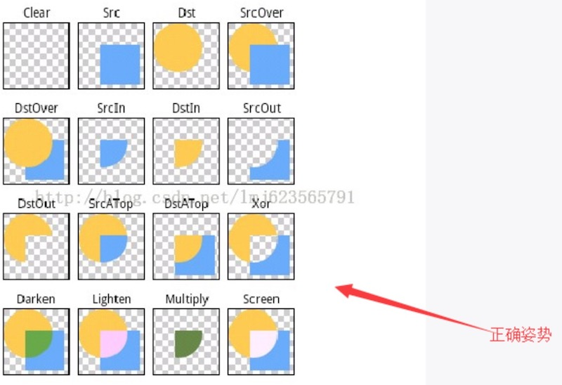

>如正确姿势的图，首先要明白的

| 名字 | 解释2  | 
| :------------: |:---------------:| 
| 黄色 | 先画,下层(dst) |
| 蓝色 | 后画,上层(src) | 
| in | 交集 | 
| out | 不相交的 | 
>举例：PorterDuff.Mode.SRC_IN参数，表示的显示的是 SRC层 IN交集的部分(注意 `这其实是DST层` 下面有解释)；
 


| 名字 | 解释2  | 
| :------------: |:---------------:| 
| `图2` |  `创建两个Bitmap` `手机宽高` `bitmap上绘制圆` `如果看不懂看下面的代码`| 
| `图1` | `绘两个圆` `如果看不懂看下面的代码` | 

#核心原理(边界)：
>Xfermode效果:作用在 `两个边界之内`；`边界之外` `没有Xfermode效果`；

| 图 |边界 | SRC_IN  | SRC_OUT  |  
| :--: | :-------: |:---------------:|:---------------:| 
| `图2` `正确姿势` | 每个都是手机的宽高  |  正确姿势图中的SRC_IN   | 如正确姿势图中的 SRC_OUT   |
| `图1` `平时的误解` | 每个都是绘的圆那么大 | 如 `正确姿势图中的SRC_IN` `多出黄色的部分` | 如 `正确姿势图中的SRC_OUT` `多出黄色的部分` |
>正确姿势图 是官方给的图；

>Tips:为什么多出黄色的部分？ 因为这个部分是 边界未相交的部分,那么不会有Xfermode的效果 所以剩下； 

>`那么大家会很疑惑，为什么DST剩下了,SRC边界之外为何不剩下？` 

>因为DST先绘制的 就是底图.SRC是为了给DST添加叠加模式的效果的.

>`最终显示的都是DST只是变成有叠加效果的DST；`


`demo效果：动画、surfaceView、绘图方面的研究->Xfermode;然后选择模式；`
[xfermode代码](https://github.com/luhaoaimama1/zone-sdk/blob/master/Android_Zone_Test/src/com/example/mylib_test/activity/animal/viewa/XfermodeView.java)

图1的代码：
```
    canvas.saveLayerAlpha(0, 0, getWidth(), getHeight(), 255,
                Canvas.ALL_SAVE_FLAG);

        paint.setColor(Color.YELLOW);
        canvas.drawCircle(getWidth() / 2, getHeight() / 2, 200, paint);
        paint.setXfermode(new PorterDuffXfermode(mode));
        paint.setColor(Color.BLUE);
        canvas.drawCircle(getWidth() / 2 + 200, getHeight() / 2 + 200, 200, paint);
```

图2的代码：
```
    //画黄色的圆 满屏幕那种 bitmap
    Bitmap bt = Bitmap.createBitmap(getWidth(), getHeight(), Bitmap.Config.ARGB_4444);
    canvas2.setBitmap(bt);
    paint.setColor(Color.YELLOW);
    canvas2.drawCircle(getWidth() / 2, getHeight() / 2, 200, paint);
    //画蓝色的圆 满屏幕那种 bitmap
    Bitmap bt2 = Bitmap.createBitmap(getWidth(), getHeight(), Bitmap.Config.ARGB_4444);
    canvas2.setBitmap(bt2);
    paint.setColor(Color.BLUE);
    canvas2.drawCircle(getWidth() / 2 + 200, getHeight() / 2 + 200, 200, paint);
```

